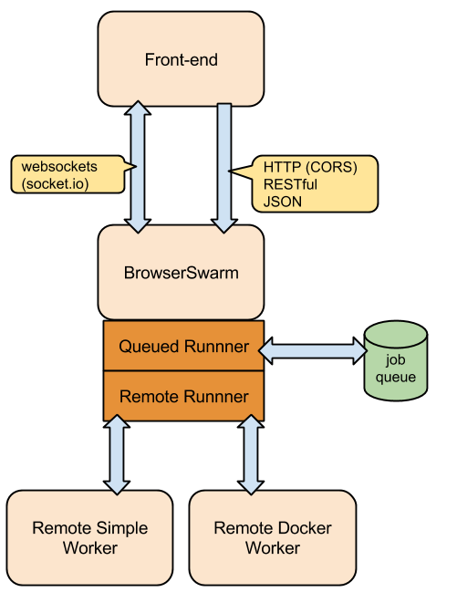

# High-level Architecture

Roles and modules:

## BrowserSwarm

Module: [BrowserSwarm](https://github.com/BrowserSwarm/browserswarm)

Implements the strider API as a service.

Configures the [strider module](https://github.com/BrowserSwarm/strider).

## Front-end

Module: [web-browserswarm.com](https://github.com/BrowserSwarm/web-browserswarm.com)

Angular-driven User Interface.

Uses Strider as a remote API invoked from the browser in Angular controllers (using CORS).

## Queued Runner

Module: [strider-queued-runner](https://github.com/BrowserSwarm/strider-queued-runner)

BrowserSwarm configures the strider module to use this module as the sole runner.

This runner uses a local persistent queue (implemented on top of [level-jobs](https://npmjs.org/package/level-jobs)), which means that jobs survive process restarts.

## Remote Runner

Module: [strider-remote-runner](https://github.com/BrowserSwarm/strider-remote-runner)

The strider-queued-runner uses this module as the default for running jobs.

This module creates a server listening on port 8632 waiting for worker connections.

When a worker connects, and sends work over when work is available.

### What about distribution?

TBD.

I was planning that we keep using local ports and use SSH tunnels between worker machines and the BrowserSwarm machine...

## Remote Simple Worker

Module: [strider-remote-simple-worker](https://github.com/BrowserSwarm/strider-remote-simple-worker)

This module is a stand-alone worker that only serves as development-time remote worker.

To start it, clone the repo and `npm start` it.

## Remote Worker Protocol

The duplex socket stream between worker and remote runner uses the [duplex-emitter](https://npmjs.org/package/duplex-emitter) protocol to transform the stream into a remote event emitter at both peers.

The server sends `spawn` commands to the worker that follow the `child_process.spawn` signature:

`spawn(command, args, options)`

The worker then sends the following events:

* `emit('stdout', buf)` - when child process outputs on stdout
* `emit('stderr', buf)` - when child process outputs on stderr
* `emit('close', code)` - when spawn finishes, with respective status code